<details>
<summary>copyable text version</summary>

```text
+----------------------------------------------------------------------+
| [eri reilly]                                                         |
| role = software engineer                                             |
| focus = full-stack systems · applied ai · infrastructure             |
| education = rutgers university — cs + marketing                      |
| website = aeiree.com                                                 |
| discord = @aeiree                                                    |
| - - - - - - - - - - - - - - - - - - - - - - - - - - - - - - - - - -  |
| [top skills]                                                         |
| languages = typescript · python · javascript · sql                   |
| frontend = react · react native · vite · capacitor · next.js         |
| backend = node.js · postgresql · supabase · postgis · sqlite         |
| ai = rag · open webui · llm tool calling · nlp                       |
| infra = docker · kubernetes · gvisor · github actions · unifi        |
| testing = jest · supertest · playwright · appium                     |
| platforms = sap · firebase · github · gitlab · jira · new relic      |
| - - - - - - - - - - - - - - - - - - - - - - - - - - - - - - - - - -  |
| [public github stats]                                                |
| repositories = 1                                                     |
| commits = 337                                                        |
| + / - = +9,645 / -6,608                                              |
| lines of code = 2,458                                                |
| - - - - - - - - - - - - - - - - - - - - - - - - - - - - - - - - - -  |
| next scheduled slot = 2026-09-23 12:00 edt                           |
+----------------------------------------------------------------------+
```

</details>

<!-- Generated by scripts/build_profile.py -->
